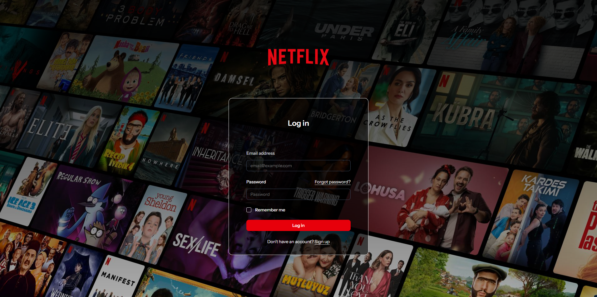
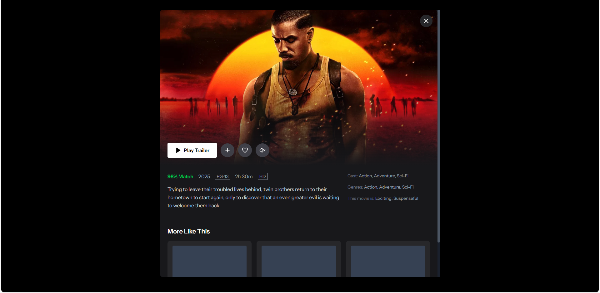
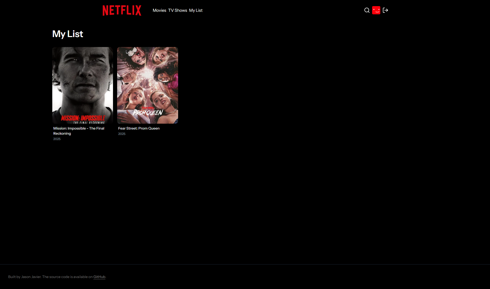

# Netflix Clone

A modern Netflix clone built with Laravel and React. This project combines the power of Laravel's backend with React's frontend to create a responsive and feature-rich streaming platform interface.

## 🚀 Technologies

### Backend
- **Laravel 12** - PHP framework for robust backend development
- **Inertia.js** - For seamless SPA-like experience without building an API
- **Laravel Tinker** - REPL for Laravel
- **Ziggy** - Exposes Laravel routes to JavaScript

### Frontend
- **React 19** - JavaScript library for building user interfaces
- **TypeScript** - For type safety
- **Tailwind CSS 4** - Utility-first CSS framework
- **Radix UI** - Unstyled, accessible UI components
- **Headless UI** - Completely unstyled, accessible UI components
- **Lucide React** - Beautiful & consistent icons
- **Zustand** - State management

## ✨ Features

- Modern UI inspired by Netflix
- Responsive design for all devices
- TypeScript integration for better development experience
- Tailwind CSS for styling
- Comprehensive component library

## 📸 Screenshots

### Login Page


### Home Page


### Movie Detail Page


### Search Page


### My List Page



## 🛠️ Installation

### Prerequisites
- PHP 8.2 or higher
- Composer
- Node.js and npm
- MySQL or another database supported by Laravel

### Setup Steps

1. **Clone the repository**
   ```bash
   git clone https://github.com/yourusername/netflix-clone-react.git
   cd netflix-clone-react
   ```

2. **Install PHP dependencies**
   ```bash
   composer install
   ```

3. **Install JavaScript dependencies**
   ```bash
   npm install
   ```

4. **Set up environment variables**
   ```bash
   cp .env.example .env
   php artisan key:generate
   ```

5. **Configure your database in the .env file**
   ```
   DB_CONNECTION=mysql
   DB_HOST=127.0.0.1
   DB_PORT=3306
   DB_DATABASE=<your_database_name>
   DB_USERNAME=<your_database_username>
   DB_PASSWORD=<your_database_password>
   ```

6. **Run migrations**
   ```bash
   php artisan migrate
   ```

7. **Start the development server**
   ```bash
   # Option 1: Run Laravel and Vite separately
   php artisan serve
   npm run dev

   # Option 2: Run everything with one command
   composer run dev
   ```

## 🧪 Testing

```bash
composer test
```

## 🚀 Deployment

For production deployment:

```bash
npm run build
```


## 🙏 Acknowledgements

- Netflix for the inspiration
- Laravel and React communities for their excellent documentation and support
